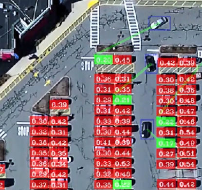

**Car-Parking Detection and Counter** 

**Short Description:** 

This project resolves the current problem of the identifying and counting of parked cars and available spaces automatically in car parks using Artificial Intelligence (AI) technology. It  is  purely  an AI-related  element,  referred  to as  computer  vision,  meaning  it  trains computers to understand the visual world. 

Additionally, when cars approach the parking area, the system automatically suggests and directs them to the nearest available parking space. 

**Core Functionalities**   

- **Parking Space Definition:** The script parking\_space\_picker.py enables the manual definition  of  parking  spaces  by  selecting  the  image  of  a  parking  area.  The coordinates of the parking space are then saved into a file for later use. 
- **Parking  Space  Counting:**  The  script  parking\_space\_counter.py  uses  the  saved parking space coordinates to monitor the occupancy of each space. It achieves this by processing the frames of a video and checking every parking lot defined for the presence of a vehicle. 
- **Vehicle  Detection:**  The  system  detects  the  vehicles  in  the  video  frame  using OpenCV's  background  subtraction  and  contour  detection  techniques.  It  also applies morphological operations to improve the quality of the detected vehicle contours.   
- **Parking Space Occupancy Visualization:** The system visualizes the occupancy of each parking space by drawing a rectangle around it. It is indicated by the color of the rectangle whether the space is occupied (red) or empty (green). 
- **Parking Space Occupancy Counting:** The number of occupied and empty parking spaces is maintained by the system, and displays this information on the video frames.   
- **Vehicle-Parking Space Association (Navigation):** For each detected vehicle, the system finds the closest empty parking space and draws a line from the vehicle to the space.   
- **ROI (Region of Interest) Definition:** This can be used to direct the focus of the parking system on the area where the parking spaces are located.  

**Requirements:** 

- The application should be able to recognize and count how many car parking spaces are in the parking area. 
- The application must be able to determine the status of each parking space as to whether it is occupied or not. 
- The application must be able to show the parking area with each parking space designated and color-coded according to its occupation state. 
- Number of empty spaces: The app should be able to display the empty spaces in the parking. 
- The program should be able to draw a line from a moving car to the nearest empty parking lot.

**Key Parameters for Evaluation**   

- **Accuracy:** Accuracy of the system to correctly identify and count the number of free and occupied parking spaces. 
- **Speed:** The speed at which the system detects the video frames and updates the count of detected parking lots. This can be measured in frames per second (FPS).   
- **Robustness:** The system's performance in handling changing lighting conditions, weather conditions, and variations in the size and color of vehicles. 
- **Scalability:** The system's ability to handle larger parking lots with more parking spaces. This can be evaluated by testing the system with parking lots of different sizes.   
- **Usability:** How easy the system is to work with, and this includes defining the parking spaces and clarity of the output display. This can be tested through user feedback.   
- **Reliability:** The system's capacity to run continuously without producing errors. This can be measured by monitoring the system over a period of time.   
- **Resource Usage:** The amount of computational resources (CPU, memory, disk space) used by the system. This can be measured using system monitoring tools. 

**The libraries used in this project:** 

- **cv2:** OpenCV library used for image processing and computer vision tasks. 
- **pickle:** Used for saving and loading the selected parking spaces. 
- **numpy:** Used for numerical operations. 
- **math:** Used for mathematical operations. 

**Initial Assumptions:**   

- The project is developed in Python, using the OpenCV library for image processing 
- The project assumes a flat surface of the parking area, and the angle of the camera is fixed. 
- The project assumes parking spaces to be in the shape of a rectangle and of fixed area. 
- The project assumes that the input is either an image (parking.png) or a video (parking.mp4). 
- The project assumes that the parking spaces are empty if the ratio of the non-zero pixel count to the total pixel count in the cropped image of the parking space is less than a certain threshold (0.22 in the provided code). 

**Implementation** 

Image1: (Main Application Interface) 

Image2: (Vehicle Detection and Vehicle-Parking Space Suggestion (Navigation)) (Parking Space Occupancy Detection and Visualization) 

Image3: Parking Space Occupancy and availability Counting

**Evaluation** 

The system was tested using a video feed of a parking area. The results showed that the 

system is able to accurately detect and count the number of available parking spaces and occupied spaces, and suggest cars to go nearest free space in real-time. However, the system's  performance  can  be  affected  by  various  factors  such  as  lighting  conditions   

The video source is from YouTube by Tom Berrigan - Busy Parking Lot
